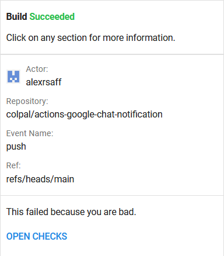

# Google Chat Notification for GitHub Actions

Sends a Google Chat notification.

This repository is inspired by [Co-qn/google-chat-notification](https://github.com/Co-qn/google-chat-notification).

Clicking on any section will take you to a webpage with more information on that section.



## Usage
### Parameters
|Name|Required|Description|
|:---:|:---:|:---|
|name|true|Job name. Used for notification titles.|
|url|true|Google Chat Webhook URL.|
|status|true|Job status. Available values are `success`, `failure`, `cancelled`. We recommend using `${{ job.status }}`|
|custom_text|false|Custom text to show in message. Supports HTML tags. Takes precedence over `custom_text_file`.|
|custom_text_file|false|File containing custom text to show in message. Supports HTML tags. `custom_text` takes precedence.|

### Examples
```yaml
- name: Google Chat Notification
  uses: colpal/actions-google-chat-notification@releases/v1
  with:
    name: Build
    url: ${{ secrets.GOOGLE_CHAT_WEBHOOK }}
    status: ${{ job.status }}
    custom_text: 'This happened because you are bad.'
  if: failure()
```